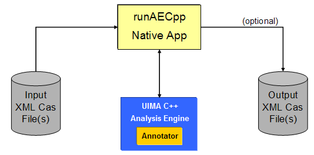
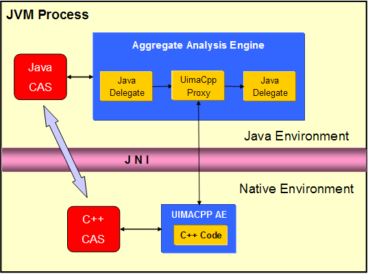

Apache UIMA C++ SDK
===================

What is the UIMA C++ SDK?
-------------------------

The UIMA C++ framework is designed to facilitate the creation of UIMA compliant Analysis Engines (AE) from analytics written in C++, or written in languages that can utilize C++ libraries. The UIMACPP SDK directly supports C++, and indirectly supports Perl, Python and Tcl languages via SWIG (https://www.swig.org/). Existing analytic programs in any of these languages can be wrapped with a UIMACPP annotator and integrated with other UIMA compliant analytics or UIMA-based applications.

A UIMA C++ AE can be used anywhere a UIMA Java AE can be used, for example, as a delegate in an aggregate AE, or as a UIMA service (using JMS, Vinci or SOAP protocols). When used in the Java framework, by default a C++ AE is instantiated and called via the JNI, running as part of the JVM process. This is also true for Vinci and SOAP services. For JMS services, the UIMACPP SDK includes a native service wrapper compatible with UIMA-AS.

The UIMA C++ framework supports testing and embedding UIMA components into native processes. A UIMA C++ test driver, `runAECpp`, is available so that UIMA C++ components can be fully developed and tested in the native environment, no use of Java is needed.

UIMA C++ includes APIs to parse component descriptors, instantiate and call analysis engines, so that UIMA C++ compliant AE can be used in native applications. However, UIMA C++ components are primarily intended to be integrated into applications using UIMA's Java-based interfaces.

Building
--------

### Checking out the code

Checkout the source code as follows:

    git clone https://github.com/apache/uima-uimacpp.git

UIMACPP runtime prerequisites are APR, ICU, Xerces-C, ActiveMQ-cpp,
APR-Util and a JDK for building the JNI interface. The SDK also
requires doxygen for building the documentation.

### Building dependencies

The Apache UIMA C++ SDK has been built and tested in 32-bit mode on Linux systems with gcc version 3.4.6 and on Windows using MSVC version 8. 64-bit builds have only been tested on Linux with gcc 4.3.2 and 4.4.6.

The UIMA C++ SDK has been built with the following versions of these dependencies:

- APR 1.3.8
- ICU 3.6
- XERCES 2.8.0
- ACTIVEMQ CPP 3.4.1
- APR-UTIL 1.3.8

If changes are made to `configure.ac` or `Makefile.am`, then configure needs to be re-generated by running `./autogen.sh` in the root of the SVN extract.

`autogen.sh` requires GNU tools at or above the following versions: automake v1.9.6, autoconf v2.59 and libtool v1.5.24.

To build the SDK, all prerequisites need to be built from source. 
Alternatively UIMACPP can be built and installed on a machine with all the prerequisites available in system directories. 
In this case the prerequisites can be installed from binary distributions.

Download and build information for these libraries are at:

- APR - http://apr.apache.org/
- APR-Util - http://apr.apache.org/
- ICU - http://www.icu-project.org/
- XERCES - http://xml.apache.org/xerces-c/
- ACTIVEMQ - http://activemq.apache.org/cms/download.html/

ACTIVEMQ CPP library version 3.2 or higher is required to support the ActiveMQ failover protocol and to support multi-byte payload data. ACTIVEMQ CPP 3.2 and higher has a dependency on APR at version 1.3.8 or higher and APR-Util 1.3.8.

### Checking on Unix

To build and install on a machine with prerequisites available in system directories:

    cd uima-uimacpp
    ./configure --with-jdk=location_of_jni.h [other options]
    make
    make check

For a full SDK build,

    ./configure --with-apr=loc_of_apr_install --with-icu=loc_of_icu_install --with-xerces=loc_of_xerces_install --with-activemq=loc_of_amq_install --with-apr-util=loc_of_apr-util_install
    make install
    make sdk TARGETDIR="loc_of_sdk_tree [clean]"

For a build of UIMACPP without UIMA-AS support, specify the option
`--without-activemq`. The options `--with-activemq` and `--with-apr-util` can be left out.

### Building on Windows

To build an SDK all prerequisite components, APR, ICU, Xerces-C,
ActiveMQ-cpp and APR-Util must first be built on the machine, and a
JDK installed. The location of the dependencies must be set in
environment variables `APR_HOME`, `ICU_HOME`, `XERCES_HOME`, `ACTIVEMQ_HOME`, `APU_HOME` and `JAVA_INCLUDE`.

    cd /myWorkingCopyUimacpp</code></li>
    winmake /build release (or debug)
    cd src\test
    devenv test.sln /build release
    fvt
    cd /myWorkingCopyUimacpp/docs
    builddocs
    buildsdk "target_dir [clean]"

### Building on OS X (experimental)

These instructions should work on the Max OSX but have not been tested.

Except for one problem with APR, building is the same here as on Linux. For the Intel-based Mac OSX machines we have tested with, the APR function to dynamically load shared libraries does not respect DYLD_LIBRARY_PATH.

A fix is to patch dso/unix/dso.c as follows:

    26a27,31
    >#if defined(DSO_USE_DYLD)
    >#define DSO_USE_DLFCN
    >#undef DSO_USE_DYLD
    >#endif

Packaging UIMA C++ annotators:

On Mac OSX, the install names are embedded in the binaries. Run the following steps manually post build to neutralize the embedded name in the UIMA C++ binary and to change the dependency path in the annotator:

* changing the install name in libuima, to neutralize it:
      
      install_name_tool -id libuima.dylib $UIMACPP_HOME/install/lib/libuima.dylib
* changing the dependency path in the annotator:

      install_name_tool -change "/install/lib/libuima.dylib" "/absolute_path_to_uimacpp_home/install/lib/libuima.dylib" MyAnnotator.dylib

Examples
--------

The UIMACPP package includes several sample UIMA C++ annotators and a sample C++ application that instantiates and uses a C++ annotator. Please go to the UIMA Download Page and get the "UIMACPP Framework" package for Linux or Windows as appropriate. For best interaoperability with the Java version of UIMA, unpack into the $UIMA_HOME directory. See the README file in the top level directory for instructions on testing the package, and follow the links there to the sample code in C++, Perl, Python and Tcl.

A UIMA C++ annotator descriptor differs from a Java descriptor in the frameworkImplementation, specifying

    <frameworkImplementation>org.apache.uima.cpp</frameworkImplementation>

For a C++ annotator, the annotatorImplementationName specifies the name of a dynamic link library. UIMACPP will add the OS appropriate suffix and search the active dynamic libary path: LD_LIBRARY_PATH for Linux, PATH for Windows, and DYLD_LIBRARY_PATH for MacOSX. The suffix is not automatically added when the annotatorImplementationName includes a path.
An annotator library is derived from the UIMACPP class "Annotator" and must implement basic annotator methods. Annotators in Perl, Python and Tcl languages each use a C++ annotator to instantiate the appropriate interpreter, load the specified annotator source and call the annotator methods.

UIMACPP Example - Running a C++ analytic in a Native Process
------------------------------------------------------------

As in UIMA, UIMACPP includes application level methods to instantiate an Analysis Engine from a UIMA annotator descriptor, create a CAS using the AE type system, and call AE methods.

`examples/src/ExampleApplication.cpp` is a simple program that instantiates the specified annotator, reads a directory of txt files, and for each file sets the document text in a CAS and calls the AE process method. For annotator development, this program can be modified to create arbitrary CAS content to drive the annotator. Because the entire application is C++, standard tools such as `gdb` or `devenv` can be easily used for debugging.

`runAECpp` is a UIMA C++ application driver modeled closely after the Java tool runAE. Like `ExampleApplication`, this tool can read a directory of text files and exercise the given annotator. In addition, `runAECpp` can take input from XML format CAS files, call the annotator's `process()` method, and output the resultant CAS in XML format files. XML format CAS input files can be created from upstream UIMA components, or created manually with the content needed to develop and unit test an annotator.

UIMACPP Example - Running a C++ analytic in a JVM Process
---------------------------------------------------------

Using the UIMA or UIMA AS packages, a UIMA C++ Analysis Engine can be used anywhere a UIMA Java AE can be used, for example, as a delegate in an aggregate AE, or as a UIMA service (using JMS, Vinci or SOAP protocols). When used in the Java framework, by default a C++ AE is instantiated and called via the JNI, running as part of the JVM process.

When a UIMA component descriptor specifies the frameworkImplementation as `org.apache.uima.cpp`, UIMA's Java framework instantiates a proxy annotator that transparently creates the UIMACPP component through the JNI. When the process(cas) method is called on the proxy, the CAS is binary serialized through the JNI into the native environment. The UIMA C++ annotator operates on the native copy of the CAS, and then the CAS is serialized back to the Java environment.

There are some limitations to this configuration:

* When more than one UIMA C++ component is colocated in the JVM, all must share identical versions of the UIMACPP framework.
* Runtime problems in the C++ code can crash the entire JVM process.
* Standard OS parameters for a process, such as program stack size, are different for a JVM process than a native process.
* Debugging native code running in a JVM process can be problematic.

UIMACPP Example - Running a C++ analytic as a Native UIMA AS Service
--------------------------------------------------------------------

With the UIMA AS package, a UIMA C++ component can be run as a UIMA AS service using the UIMA C++ application `deployCppService`. This application instantiates a UIMA C++ AE from the specified annotator descriptor, and then connects to the specified ActiveMQ broker and input queue. In order to take advantage of multi-core hardware, `deployCppService` supports instantiating multiple copies of the C++ analytic, each in a different thread; this option requires the analytic to be designed for multithreaded operation.

Once deployed, the service can be utilized from UIMA applications and aggregate analysis engines in exactly the same way as other UIMA AS services written in Java.

UIMA AS services written in Java are deployed using UIMA Deployment Descriptors. These descriptors, which specify the UIMA component descriptor to instantiate and the connectivity and error handling options, are used by the UIMA utility `deployAsyncService` to launch a Java service. Deployment Descriptors have special support for UIMA C++ services, with the ability to provide lifecycle management, JMX monitoring and integrated logging of C++ native services. This support is enabled when the UIMA AS Deployment Descriptor specifies

    <custom name="run_top_level_CPP_service_as_separate_process"/>

in which case Java will launch deployCppService as a separate process on the same machine and establish socket connections for logging and monitoring.
Note that in this case the Deployment Descriptor can also specify the environment for the native process using entries such as

    <environmentVariable name="LD_LIBRARY_PATH">/home/user/apache-uima-as/uimacpp/lib</environmentVariable>

This feature enables multiple UIMA C++ components with different levels of UIMACPP to be managed by the same JVM.

